

# 🎁 מערכת ניהול מכירה סינית - צד לקוח (Angular)

### 📝 תיאור ומטרת הפרויקט
בס"ד.

 פרויקט Web API - מכירה סינית. צד השרת – Web API, צד לקוח – Angular. 
 
 מטרת הפרויקט: ניהול מכירה סינית, הן כניסה מצד לקוחות והן כניסה מצד ההנהלה.

---

### 👑 משתמש הנהלה (Manager Role)
עמוד כניסה עם שם משתמש וסיסמה. משתמשי הנהלה קיימים מראש ב-DB. אבטחת מידע ע"י תגית `[Authorize(Roles = "manager")]` ושימוש ב-JWT תקין.

**ניהול תורמים:**
* צפייה ברשימת התורמים.
* הוספה/מחיקה/עדכון של תורם.
* כל תורם מכיל פרטים אישיים ואת רשימת התרומות שלו.
* אפשרות סינון של תורם לפי (שם/ מייל/ מתנה).

**ניהול מתנות:**
* צפייה ברשימת המתנות (כל מתנה מכילה גם שדה של קטגוריה).
* הוספה/ מחיקה/ עדכון של מתנה.
* כל מתנה – מי התורם שלה.
* מחיר כרטיס הגרלה ואופציה להוסיף תמונה.

**ניהול רכישות:**
* צפייה ברכישות כרטיסים עבור כל מתנה.
* צפייה בפרטי הרוכשים.

**ההגרלה בפועל:**
* המנהל מבצע את ההגרלה מתוך רשימת הרוכשים.
* יצירת דוח שאומר כל מתנה מי הזוכה.
* יצירת דוח של סך ההכנסות למכירה.
* **אתגר:** שליחת מייל לזוכה בהגרלה.

---

### 👤 משתמש לקוח (Customer Interface)
* **מסך כניסה/רישום:** מילוי פרטים (שם, טלפון, מייל) עם בדיקות וולידציה גם בשרת.
* **רשימת מתנות:** צפייה ומיון לפי מחיר או קטגוריה.
* **סל קניות:** בחירת מתנה (אפשרי מספר פעמים). נשמר ב-Cookies כטיוטה עד לאישור הקנייה.
* **מגבלות:** לא ניתן למחוק מתנה לאחר רכישה (בזמן טיוטה ניתן).
* **לאחר הגרלה:** המשתמש רואה את הזוכים ואינו יכול לבצע רכישה.

---

### 📸 תצוגת המערכת (כל צילומי המסך)

**כניסה והרשמה:**
| 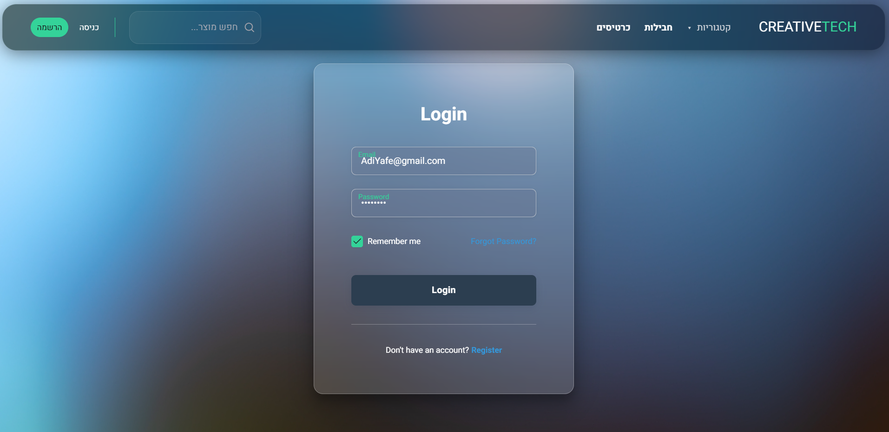 | 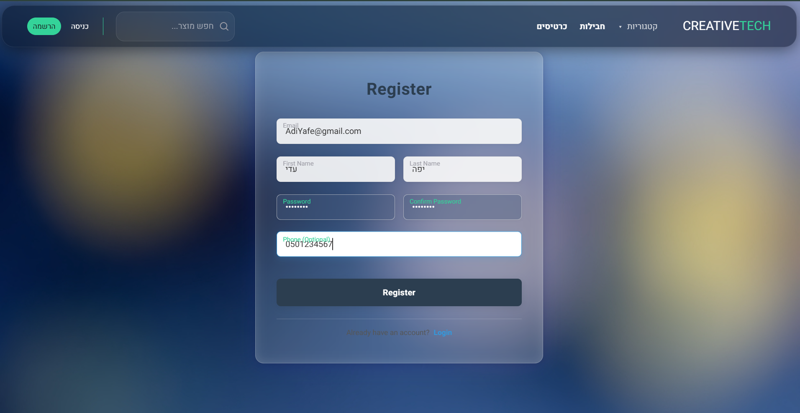 |
| :---: | :---: |

**ממשק ניהול (מנהל):**
* רשימת תורמים: 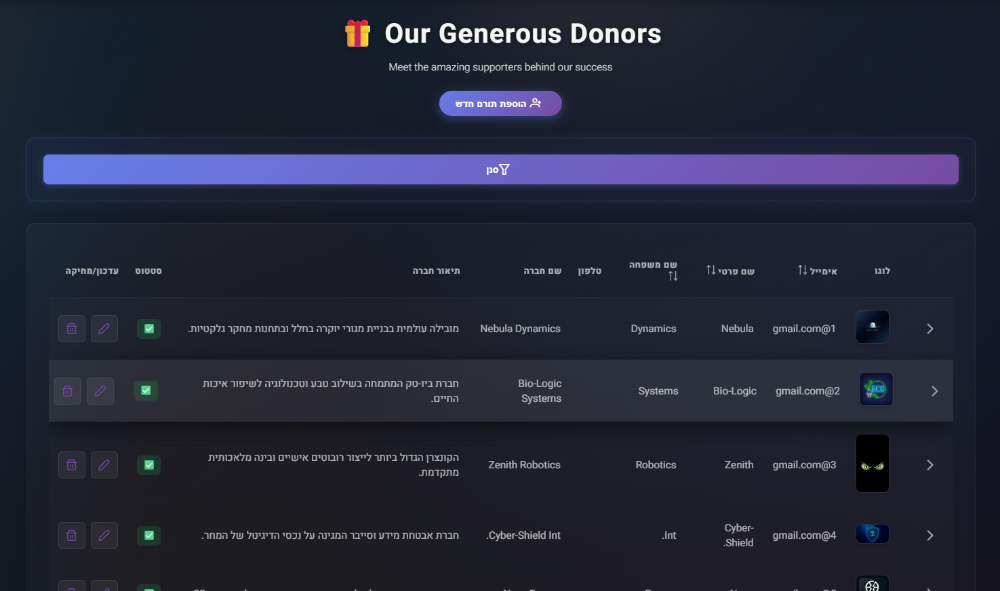
* הוספת תורם: 

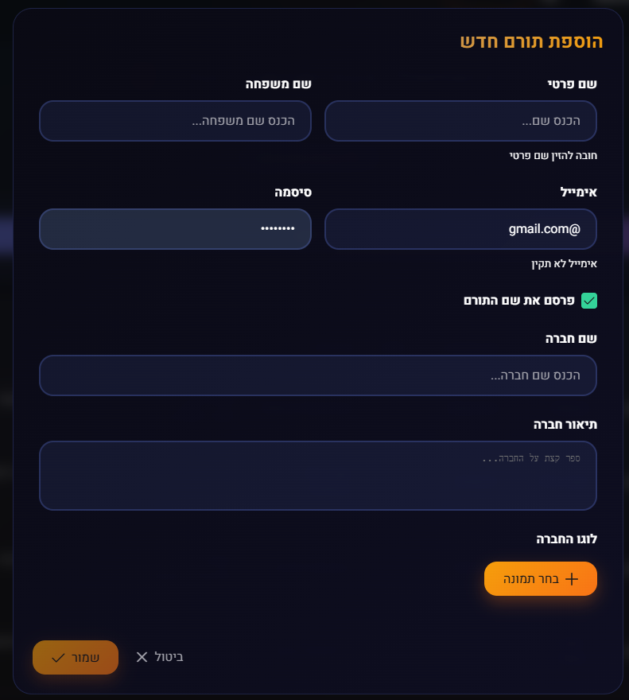
* תרומות לפי תורם: 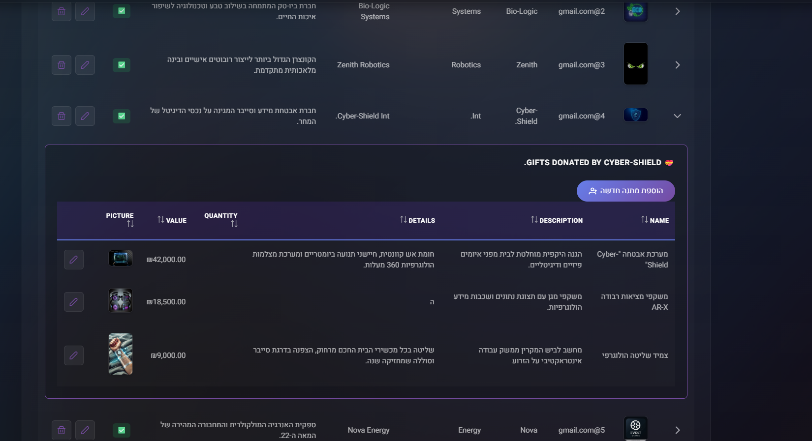
* קטלוג ומתנות: 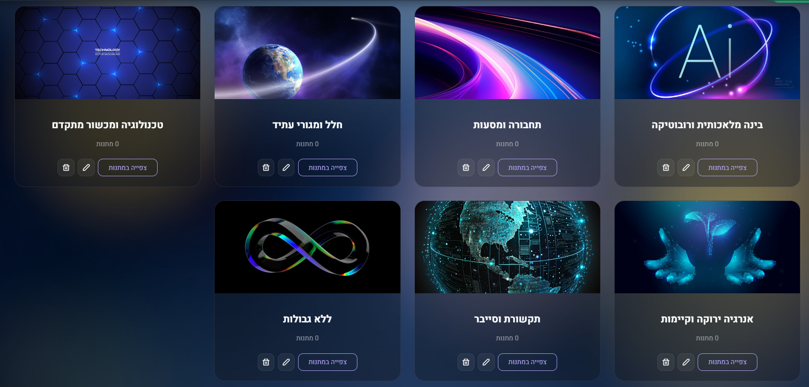
* הוספת מתנה:

 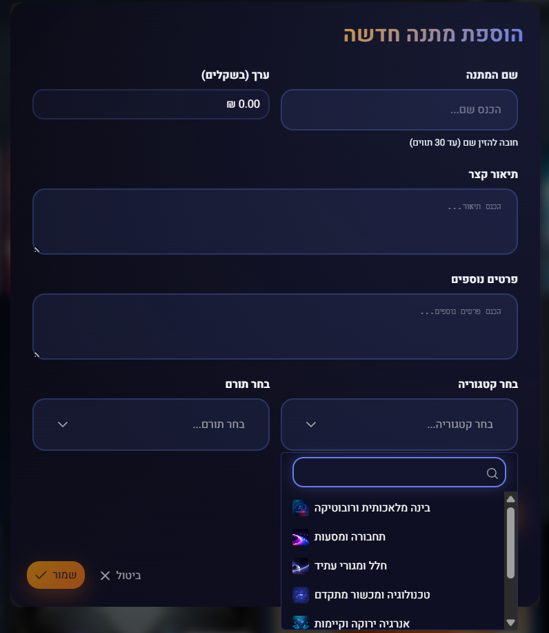
* ניהול חבילות: 

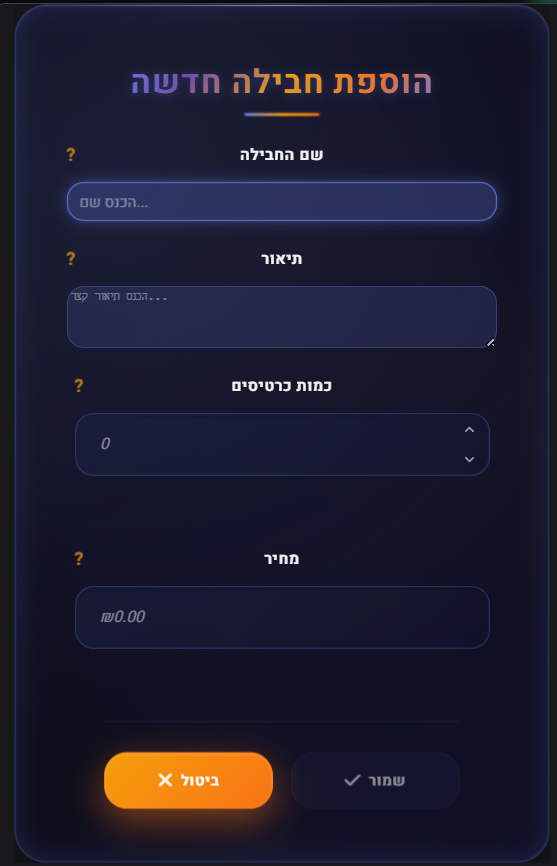

**תהליך ההגרלה:**
| שלב 1 | שלב 2 | שלב 3 |
| :---: | :---: | :---: |
| 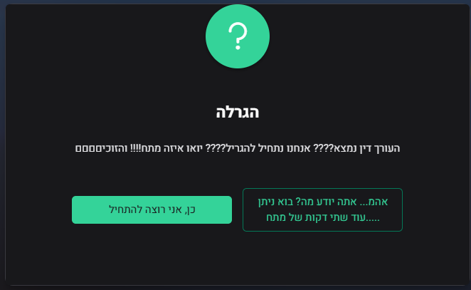 | 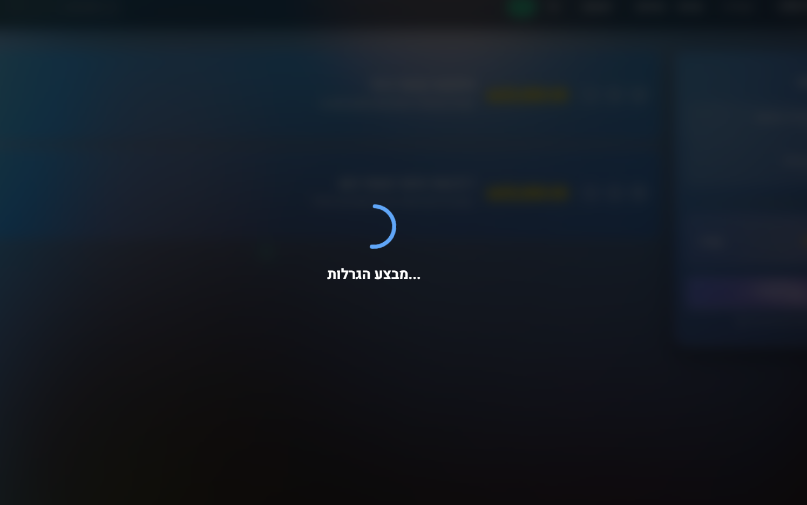 | 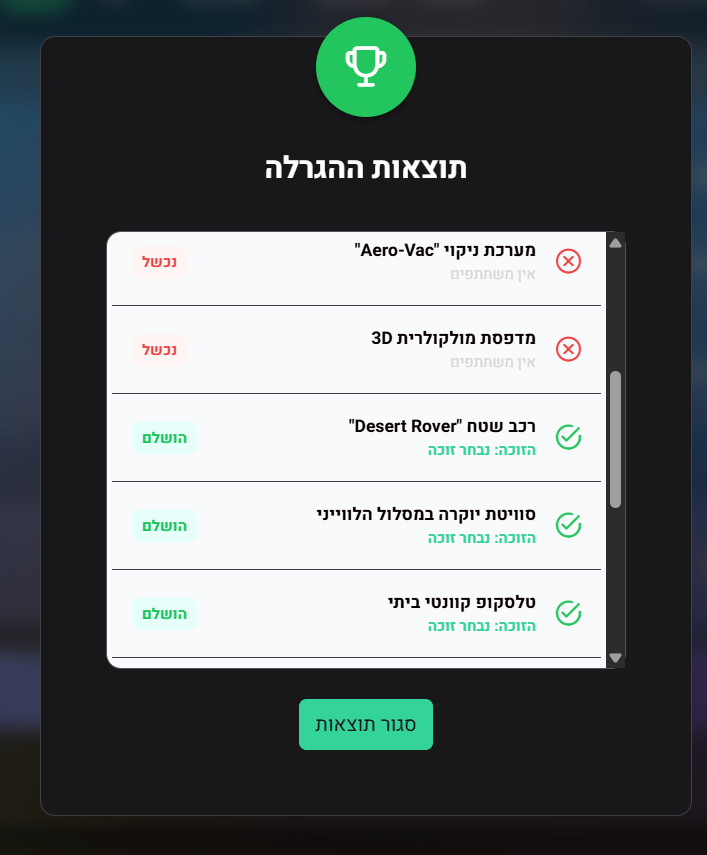 |

**ממשק לקוח:**
* גלריית מתנות: 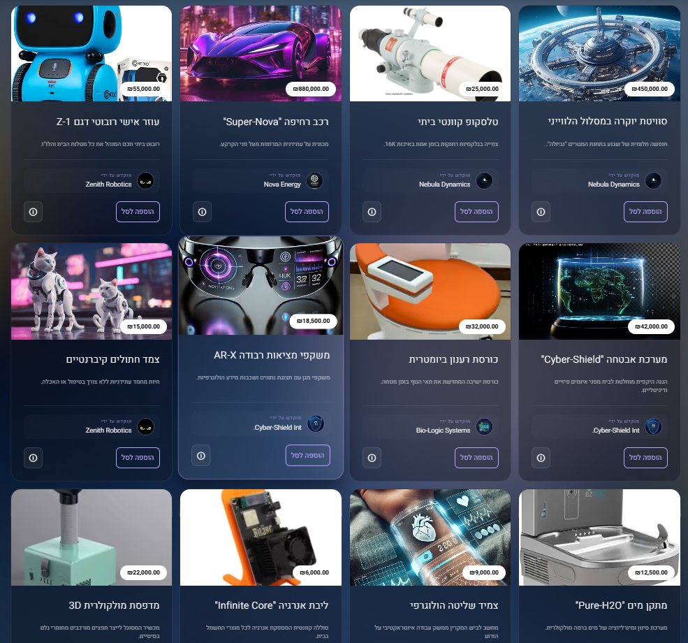
* סינון קטגוריות: 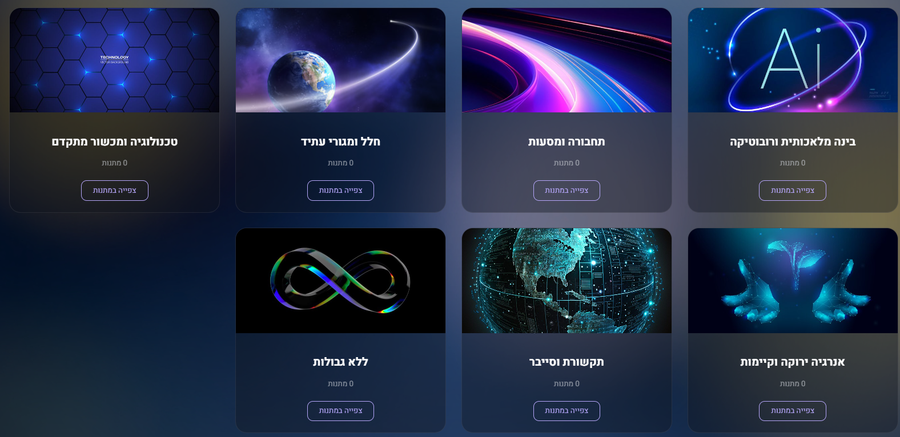
* בחירת חבילות: 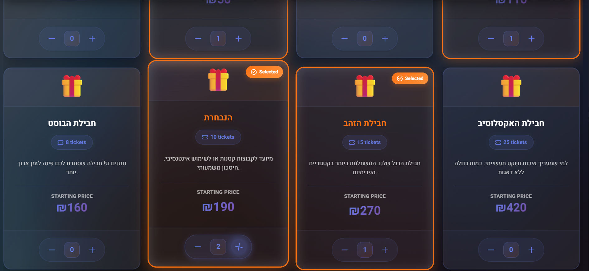
* סל קניות: 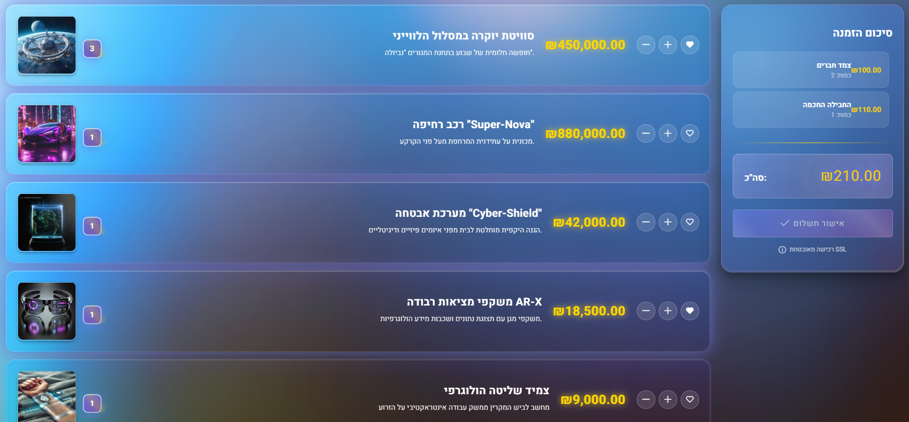
* סל ריק: 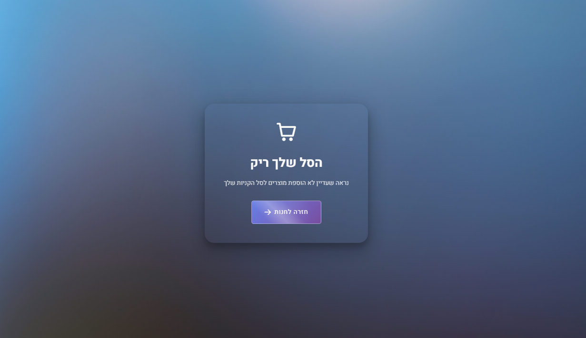
* אפשרויות משתמש: 

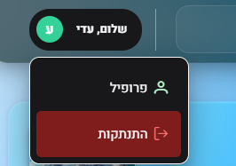
* תוצאות (אחרי הגרלה): 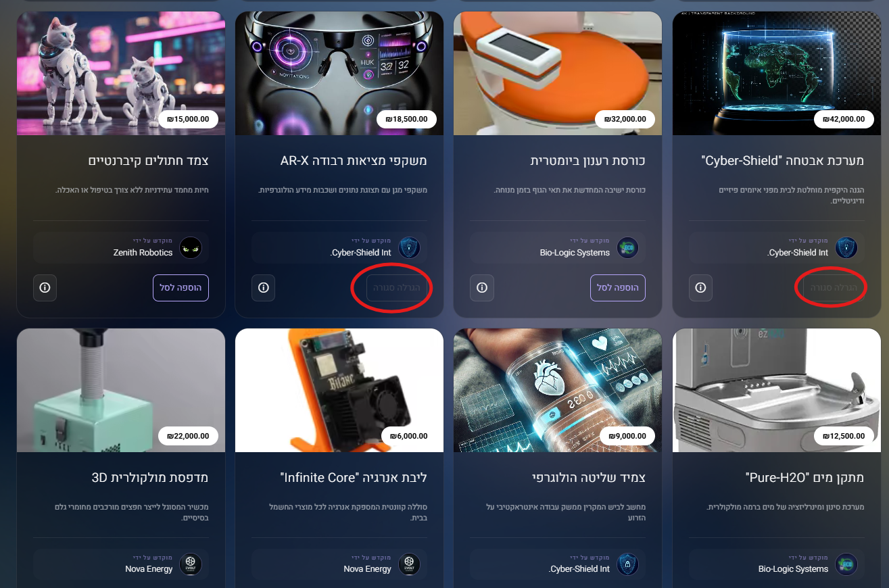

**פיצ'רים נוספים:**
* שליחת מייל לזוכה: 

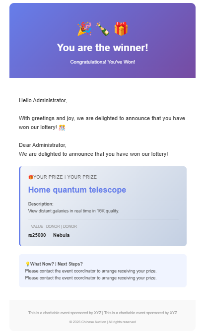
* ניווט מנהל: 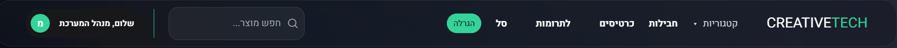
* ניווט לקוח: 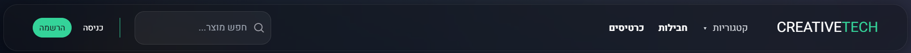

---
### 🚀 הוראות הרצה
1. בצע Clone לפרויקט למחשב המקומי.
2. הרץ `npm install` בתיקיית הלקוח (Angular) להתקנת הספריות.
3. וודא שצד השרת (Web API) פועל ומחובר ל-DB (Code First).
4. הרץ `ng serve` להפעלת ממשק הלקוח.
5. המערכת תהיה זמינה בכתובת: `http://localhost:4200`.

---
**פותח כפרויקט גמר המשלב Web API & Angular. בהצלחה!**

